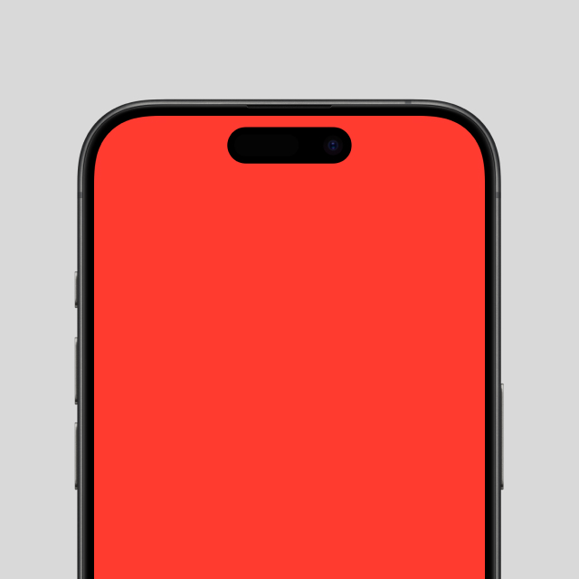
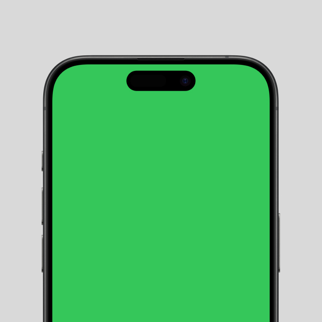
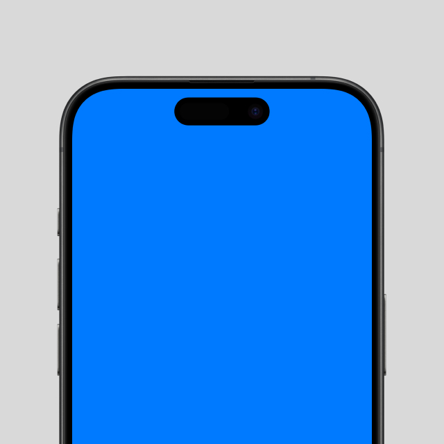

## Description

A brief description of what this project does and who it's for. Highlight the key features or the problem it solves.

## Table of Contents

- [Installation](#installation)
- [Usage](#usage)
- [Features](#features)
- [Screenshots](#screenshots)
- [Technologies Used](#technologies-used)
- [Configuration](#configuration)
- [Contributing](#contributing)
- [License](#license)
- [Contact](#contact)

## Installation

Provide step-by-step instructions on how to install and set up your project.

```bash
# Example installation steps
git clone https://github.com/yourusername/projectname.git
cd projectname
swift package resolve  # If using Swift Package Manager dependencies
```

## Usage

Explain how to use your application. Provide code examples if applicable.

```swift
// Example usage code
import YourModule

let instance = YourClass()
instance.doSomething()
```

## Features

List the key features of your application:

- Feature 1
- Feature 2
- Feature 3
- ...

## Screenshots

Include screenshots or GIFs of your application in action.

| Screenshot 1 | Screenshot 2 | Screenshot 3 |
|:------------:|:------------:|:------------:|
|  |  |  |

## Technologies Used

- Swift 5.5+
- SwiftUI
- Combine
- Swift Package Manager
- ...

## Configuration

Explain any configuration steps, environment variables, or settings users need to be aware of.

### Dependencies

If your project uses Swift Package Manager dependencies, you can list them here:

```swift
dependencies: [
    .package(url: "https://github.com/Alamofire/Alamofire.git", .upToNextMajor(from: "5.0.0")),
    // Add other dependencies here
]
```

## Contributing

Explain how other developers can contribute to your project. For example:

1. Fork the Project
2. Create your Feature Branch (`git checkout -b feature/AmazingFeature`)
3. Commit your Changes (`git commit -m 'Add some AmazingFeature'`)
4. Push to the Branch (`git push origin feature/AmazingFeature`)
5. Open a Pull Request

## License

This project is licensed under the [MIT License](LICENSE).

## Contact

Wayne Dahlberg on X - [@waynedahlberg](https://x.com/waynedahlberg)

Email - mail [ at ] wayned [ dot ] net

Project Link: [https://wayned.net/labs/conceptname](https://wayned.net/labs/conceptname)

---

Remember to star ⭐ this repository if you find it helpful!